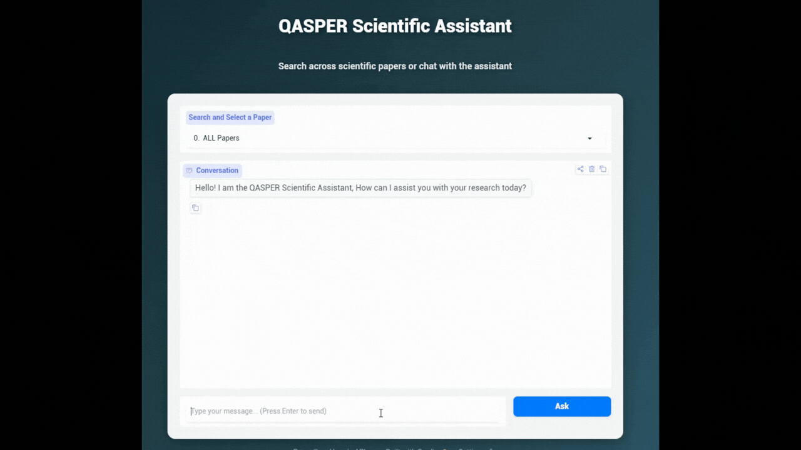
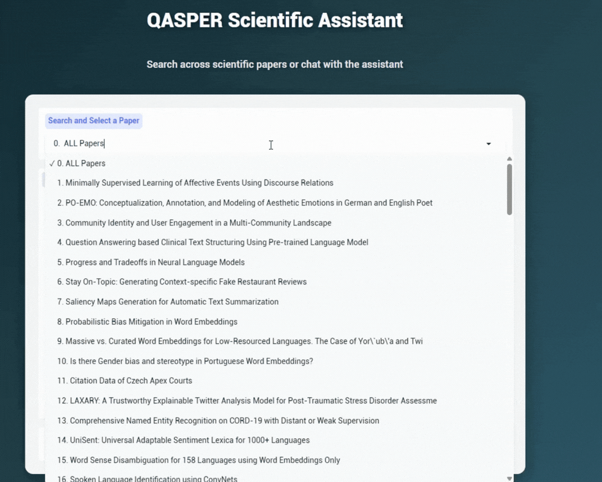
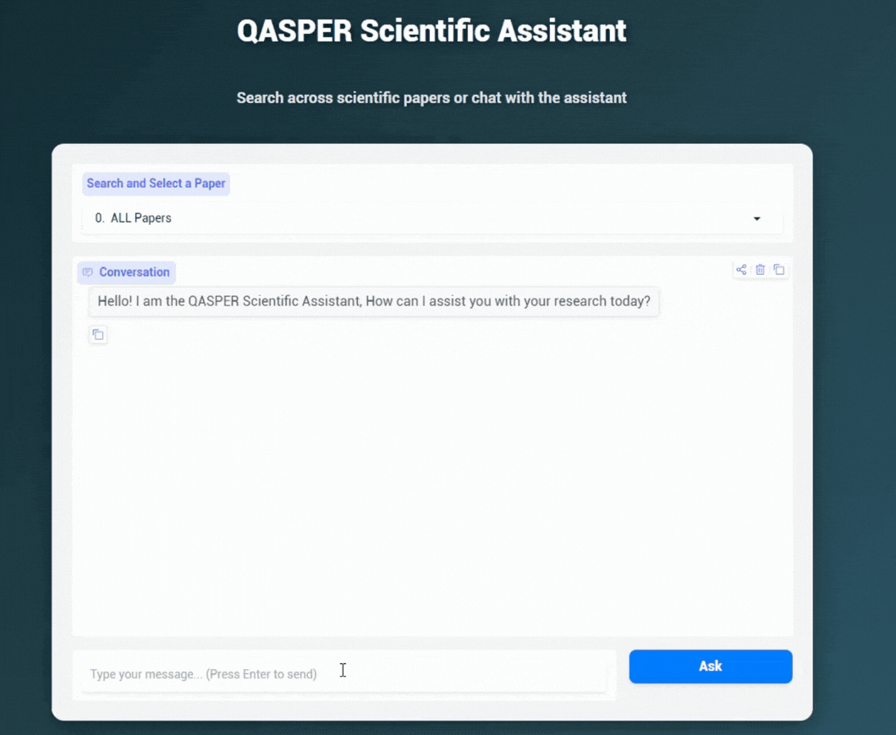
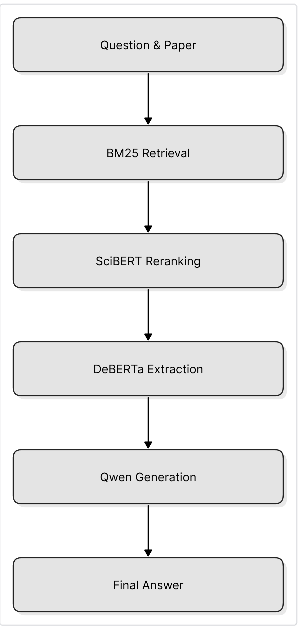
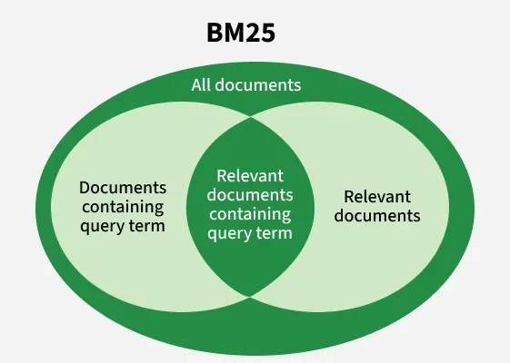
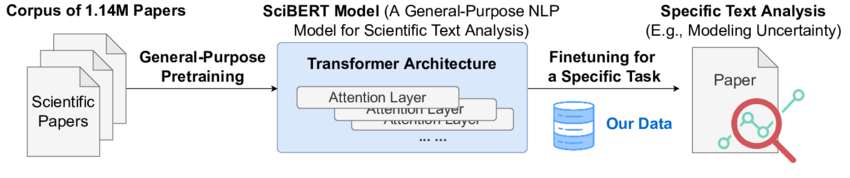
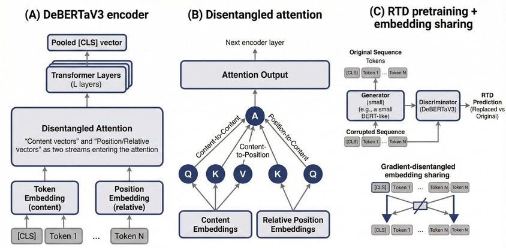

# QASPER Scientific QA Assistant

A scientific question-answering system built on the QASPER dataset. The system retrieves relevant parts of research papers, reranks the retrieved content, extracts a candidate answer, and then uses a grounded language model to prepare the final response.

The project was designed as a practical, end-to-end QA pipeline rather than relying on a single large language model. Each stage has a specific role in finding, verifying, and answering questions from complex scientific papers.

## System Demonstrations

Below are three demonstrations showing how the assistant handles different types of user queries.

### 1. General Question Across All Papers



### 2. Question About a Specific Paper



### 3. Unsupported or Out-of-Scope Question



## How the System Works

The system follows a multi-stage retrieval and question-answering pipeline. The main idea is to avoid asking one model to perform the entire task. Instead, the architecture separates retrieval, reranking, answer extraction, and final response generation.



### Stage 1: BM25 Retrieval

The first stage performs a fast global search over the available paper content using BM25.

Instead of sending every paragraph from every paper to the later stages, the system uses BM25 to reduce the search space to a smaller set of potentially relevant paragraphs. BM25 is lightweight and effective as an initial lexical retrieval method before introducing heavier neural models. The current system retrieves up to 30 candidate paragraphs during this stage.



### Stage 2: SciBERT Reranking

The paragraphs retrieved by BM25 are passed to a SciBERT-based cross-encoder.

Because QASPER consists of questions and answers grounded in highly technical papers, SciBERT provides a domain-specific representation for evaluating the relationship between the question and each retrieved paragraph. The reranker assigns a relevance score to each candidate, and the highest-scoring paragraphs are passed to the extraction stage.



### Stage 3: DeBERTa-v3 Extractive QA

The selected paragraphs are passed to a DeBERTa-v3-based extractive question-answering model.

This stage is responsible for identifying the candidate answer span within the retrieved context rather than generating an answer from scratch. The model predicts the start and end positions of candidate answers, and the pipeline evaluates multiple retrieved paragraphs and answer spans before selecting the most confident candidate.



### Stage 4: Qwen Grounding and Fallback

The final stage uses Qwen2.5-1.5B-Instruct as a conversational and grounding layer. Rather than being used as the primary source of scientific knowledge, Qwen receives the extracted answer and supporting evidence/context produced by the earlier stages.

Its main responsibilities are:

* Explain the extracted answer in a natural, conversational way.
* Keep the response grounded in the retrieved evidence.
* Handle cases where the available evidence does not sufficiently support an answer.
* Provide a fallback response instead of generating unsupported scientific claims.

## Development Challenges: The SQuAD Problem

One of the main challenges during development was discovering that standard, off-the-shelf QA models trained on SQuAD do not always transfer well to scientific documents.

A standard SQuAD-style pipeline assumes that the provided context is relatively focused and that the answer can be identified within it. In contrast, scientific papers in QASPER contain dense technical language, long paragraphs, complex formatting, and questions that may require selecting the correct evidence from a larger document. QASPER also includes questions that are not answerable from the available evidence.

Applying a standard extractive QA pipeline directly to this setting resulted in extraction failures and unsupported answers. This motivated the multi-stage approach used in this project:

**Retrieve → Rerank → Extract → Ground**

The pipeline combines BM25 for efficient candidate retrieval, SciBERT for scientific-domain reranking, DeBERTa-v3 for answer extraction, and Qwen for the final grounded response.

## Evaluation

The project was evaluated at different stages of the pipeline to isolate component performance.

### Retrieval Results

| Component | Metric    | Result |
| :-------- | :-------- | :----- |
| BM25      | Recall@30 | 95.00% |
| SciBERT   | Recall@1  | 43.00% |
| SciBERT   | Recall@5  | 79.00% |
| SciBERT   | Recall@10 | 87.00% |

### QA Results (Gold Context)

When the correct context is provided directly to the QA stage, the extraction ability can be evaluated separately from retrieval:

| Evaluation             | Result  |
| :--------------------- | :------ |
| Gold-context Answer F1 | 76.07%  |
| Gold-context EM        | ~48.00% |

### End-to-End System Performance

When evaluated from the original question through retrieval, reranking, answer extraction, and final candidate selection:

* **End-to-End F1: ~41.40%**

This value is the primary end-to-end metric reported for this project. Different configurations and candidate-selection settings produced slightly different results during experimentation, but **41.40% is used as the official project result**.

## Related Results on QASPER

To provide context for the difficulty of the task, the table below compares this project with selected published systems evaluated on QASPER.

The published results use their respective evaluation setups, so these values should be treated as reference points rather than as a strict reproduction of a common experimental configuration.

| Work / System                | Main Approach                          |  Answer F1  | Evidence F1 |
| :--------------------------- | :------------------------------------- | :---------: | :---------: |
| **QASPER Official Baseline** | Longformer Encoder-Decoder (LED)       |    33.63    |    29.85    |
| **DRC Framework**            | PDF Extraction + Retriever + UnifiedQA |    39.22    |      —      |
| **Document Structure Study** | Structure-enhanced LED                 |    39.08    |    44.41    |
| **Visconde**                 | Neural Reranking + GPT-3               |    49.10    |    38.50    |
| **This Project**             | BM25 + SciBERT + DeBERTa-v3 + Qwen     | **41.40%*** |      —      |

The official QASPER baseline reports 33.63 Answer F1 and 29.85 Evidence F1 using LED-base.

The DRC framework reports 39.22 Answer F1 on the QASPER test set for its weakly supervised end-to-end configuration.

The Document Structure study reports 39.08 Answer F1 and 44.41 Evidence F1 for its `emb-type-tok-depth` LED configuration on QASPER.

Visconde reports 49.1 Answer F1 and 38.5 Evidence F1 on QASPER.

* The final value for this project is an end-to-end project metric from the project's own evaluation setup and is not claimed to be an exact reproduction of the official QASPER evaluation protocol. The comparison is provided as a reference point.

## Repository Structure

The repository contains the two main notebooks used to develop and run the project:

```text
QASPER-Scientific-QA/
│
├── archive/                     # Legacy experimental notebooks
├── QASPER_Training_Lab.ipynb    # Training, evaluation, and pipeline metrics
└── QASPER_Production_App.ipynb  # Final inference application and UI
```
